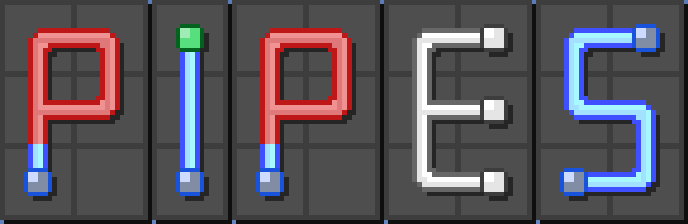
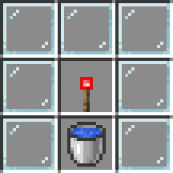
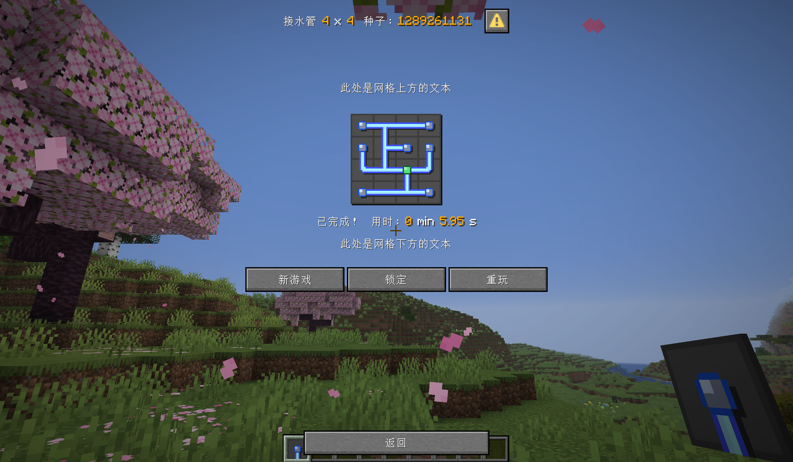
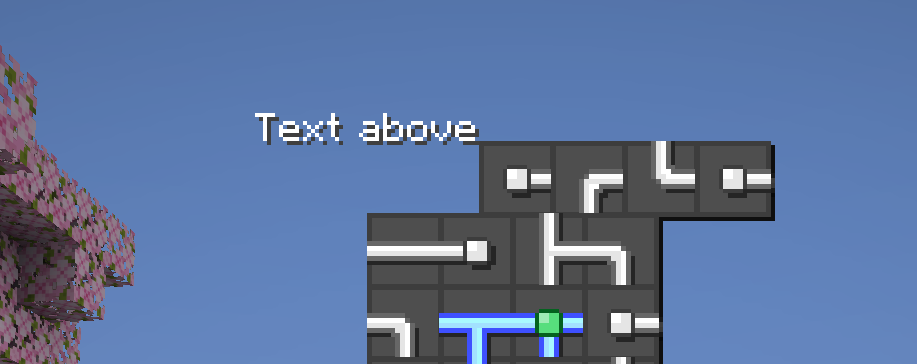

[中文版本](README.md)

# Pipes-Mini-game-for-Minecraft

Supported Version: 26.1.2

Official namespace: `pipes`



## 1. For Players

**Please make sure to download and install the accompanying Resource Pack, otherwise the game interface will look very glitched!**

**How to start normally?** You can craft a **Pipes trigger** using the recipe below. In reality, this item is a **Carrot on a Stick**, so it will inevitably attract pigs and can be used to control ridden pigs.



Hold the Pipes Trigger and press `right click` to open the main menu of the Pipes mini-game. This item can be used infinitely.

You can quickly obtain this item by using the following command:

```mcfunction
loot give @s loot pipes:pipes_trigger
```

During gameplay, you might encounter issues where the game interface exceeds your current screen width/height, or the game grid is not centered. This depends on your current client resolution and GUI scale. Unfortunately, Mojang does not provide any method for datapacks to read resolution and GUI scales, so these options must be manually adjusted by you to fit your screen.

---

## 2. For Developers

You can either install this datapack directly into your world to play it, embed it inside your own datapack, or use it as a library datapack for your larger projects. Note that **you must agree to and abide by the license associated with this datapack**.

If you are using this datapack as a sub-datapack inside another datapack, some file paths might conflict. After specifying the corresponding field in the metadata `overlays`, you can modify this datapack by following these steps:

1. Delete all content under the `minecraft` namespace.
1. Ensure that the `pipes:load` function is invoked by your main datapack's `#minecraft:load` function tag, or by a function/sub-function invoked by it.

The same applies to the resource pack.

**Warning! This datapack makes the following changes which may cause compatibility conflicts:**

```mcfunction
gamerule send_command_feedback false
gamerule max_command_sequence_length 1000000
```

Below is an introduction to some developer-facing features of this datapack:

### 2.1 Generating Pipes Puzzles Directly via Command

- You can specify the width and height of the grid to generate a random Pipes puzzle using the following format:
  ```mcfunction
  function pipes:generate/random {w:<width>,h:<height>}
  ```

- You can also use seeds to generate fixed, deterministic puzzles:
  ```mcfunction
  function pipes:generate/seed {w:<width>,h:<height>,seed:<seed>}
  ```

  All data arguments passed above must be integers.

- The last generated puzzle can be restored using the following command:
  ```mcfunction
  scoreboard players set <player> pipes.trigger 2
  ```

  Where `<player>` can be any player who needs to trigger this feature. This feature can only restore the immediately preceding puzzle; puzzles prior to that cannot be recovered.

- Instantly generate Pipes puzzles of specific sizes (only valid when the `trigger` setting is set to `true`, see Section [2.2.3](#223-trigger) ):
  | Size | commmand |
  | --- | --- |
  | $4 \times 4$ | `scoreboard players set <player> pipes.trigger 4` |
  | $5 \times 5$ | `scoreboard players set <player> pipes.trigger 5` |
  | $6 \times 6$ | `scoreboard players set <player> pipes.trigger 6` |
  | $7 \times 7$ | `scoreboard players set <player> pipes.trigger 7` |
  | $8 \times 8$ | `scoreboard players set <player> pipes.trigger 8` |
  | $9 \times 9$ | `scoreboard players set <player> pipes.trigger 9` |
  | $10 \times 10$ | `scoreboard players set <player> pipes.trigger 10` |
  | $11 \times 11$ | `scoreboard players set <player> pipes.trigger 11` |
  | $12 \times 12$ | `scoreboard players set <player> pipes.trigger 12` |
  | $13 \times 13$ | `scoreboard players set <player> pipes.trigger 13` |
  | $14 \times 14$ | `scoreboard players set <player> pipes.trigger 14` |
  | $15 \times 15$ | `scoreboard players set <player> pipes.trigger 15` |
  | $16 \times 16$ | `scoreboard players set <player> pipes.trigger 16` |

- To open the main menu interface of the Pipes mini-game:
  ```mcfunction
  scoreboard players set <player> pipes.trigger 1
  ```

### 2.2 Game settings

The mini-game features several configuration options stored within the `settings` path of the command storage `pipes:grid`. This field is a compound tag where each child tag represents an individual configuration option. **You can modify option data directly using `/data`, or you can modify them using the functions detailed below. The latter method is recommended, as modifying options via functions may trigger necessary companion operations.**

#### 2.2.1 record

A boolean option with valid values `true` and `false`. This option controls whether each round of the game is timed. Players can freely modify this in the Pipes menu page; the default value is `true`.

- Command to set to `true`: `function pipes:settings/record/true`
- Command to set to `false`: `function pipes:settings/record/false`

#### 2.2.2 rotation_direction

A string option with valid values `clockwise` and `counterclockwise`. This controls the direction in which the player rotates the pipes. It can be freely adjusted in the menu page; the default value is `clockwise`.

- Command to set to `clockwise`: `function pipes:settings/rotation_direction/clockwise`
- Command to set to `counterclockwise`: `function pipes:settings/rotation_direction/counterclockwise`

#### 2.2.3 trigger

A boolean option with valid values `true` and `false`. This option controls whether the Pipes mini-game menus are enabled. This option cannot be modified from within the menu pages; the default value is `true`. If set to `false`, all menu buttons are disabled, and the action to call up the main menu using the Pipes Trigger is also disabled. **If you do not want players to freely open and play Pipes inside your custom adventure maps/creations, but instead want Pipes to act strictly as context-specific puzzles, you should set this option to `false`.**

- Command to set to `true`: `function pipes:settings/trigger/true`
- Command to set to `false`: `function pipes:settings/trigger/false`

### 2.3 Customizing Pipes

Aside from the core puzzle logic of Pipes, all visual content displayed on the game interface can be fully customized, including the grid textures.



If you have heavily modified this content and wish to restore everything to default, you can use the following commands to perform a one-click reset:

```mcfunction
function pipes:custom/reset
```

or

```mcfunction
function #pipes:custom_reset
```

#### 2.3.1 Title

The content displayed as the dialog title. By default, it displays "Pipes \<width> x \<height>  Seed: \<Seed of the puzzle>", In storage, its default value is `{translate:"dialog.pipes.game.title"}`。

You can modify this title to whatever you need. **The title data is stored in the command storage `pipes:grid` under the path `dialog.game.title`, and its value must be a text component.** For example, if you want the title to display nothing:

```mcfunction
data modify storage pipes:grid dialog.game.title set value ""
```

If you want the title to display the plain text "Pipe Repair Station A", you can execute:

```mcfunction
data modify storage pipes:grid dialog.game.title set value "Pipe Repair Station A"
```

To restore the default title content, execute:

```mcfunction
function pipes:custom/title/reset
```

#### 2.3.2 Text Above Grid

This text is displayed right above the Pipes game grid. By default, it is an empty string and shows nothing. Its data is stored in the command storage `pipes:grid` under the path `dialog.game.body.contents[1]`. To accommodate various layout needs, no default newline character is appended between this text and the grid. If you do not add line breaks at the end of your text:

```mcfunction
data modify storage pipes:grid dialog.game.body.contents[1] set value "Text above"
```

It will look like this:



If you don't want it to display like that, you need to add newline characters after the text:

```mcfunction
data modify storage pipes:grid dialog.game.body.contents[1] set value "Text above\n\n"
```

To restore the default content, execute:

```mcfunction
function pipes:custom/text_above/reset
```

#### 2.3.3 Grid

While it is not recommended to modify the grid rendering logic, you can customize the textures of the grid, allowing every single Pipes puzzle to have a unique appearance.

The grid textures are implemented via custom fonts. Every single slot is assigned a unique code point character. The table below lists the code points corresponding to all pipe shapes:

| Pipe Type (Open State) | Char | Pipe Type (Locked State) | Char |
| --- | --- | --- | --- |
|  | a |  | A |
|  | b |  | B |
|  | c |  | C |
|  | d |  | D |
|  | e |  | E |
|  | f |  | F |
|  | g |  | G |
|  | h |  | H |
|  | i |  | I |
|  | j |  | J |
|  | k |  | K |
|  | l |  | L |
|  | m |  | M |
|  | n |  | N |

**A pipe type has 4 variants: Normal (`normal`), Flooded (`flood`), Warning (`warning`), and Source (`source`). There is a field named `style` inside the command storage `pipes:grid` which stores the font namespace IDs used by each variant.** The default values are as follows:

```
style: {
  flood:"pipes:tube_flooded",
  normal:"pipes:tube",
  source:"pipes:tube_source",
  warning:"pipes:tube_warning"
}
```

You can design custom fonts based on the code point table above, and then change the font resource mapped to the corresponding variant in storage. The backend system will apply your custom font automatically. For example, if you created a custom font asset named `custom:your_style` for `normal` pipes, you can apply your custom style to the grid like this:

```mcfunction
data modify storage pipes:grid style.normal set value "custom:your_style"
```

Note that this only changes the appearance of `normal` pipes; other pipe variants will remain unaffected.

To restore the default appearance, execute:

```mcfunction
function pipes:custom/style/reset
```

#### 2.3.4 Completion Message and Time Record

When a player solves the current Pipes puzzle, a line of text appears below the grid saying: "Completed!". If the `record` setting is set to `true`, the time spent on this round will follow right after. You can also customize this string of text. When `record` is set to `true`, this text is stored in the command storage `pipes:grid` under the path `record.is_true`. Its default value is:

```
{translate:"dialog.pipes.game.time",with:[{color:"gold",text:""},{color:"gold",text:""},{color:"gold",text:""}]}
```

When `record` is set to `false`, this text is stored in the command storage `pipes:grid` under the path `record.is_false`. Its default value is:

```
{translate:"dialog.pipes.game.complete"}
```

If you wish to change the text displayed when `record` is `true` (for instance, changing it to "Done!"), you can run the following command:

```
data modify storage pipes:grid record.is_true set value "Done!"
```

You can pass the time elapsed during the round into this text by utilizing translatable text along with the `with` tag, where:

- Element index 0 of `with` automatically receives the minutes.
- Element index 1 of `with` automatically receives the integer part of the seconds.
- Element index 2 of `with` automatically receives the decimal part of the seconds.

For example, if you want the text to say "Done within xxx minutes and xxx seconds", passing the minutes and the integer part of the seconds, you should write it like this:

```
data modify storage pipes:grid record.is_true set value {translate:"Done within %1$s minutes and %2$s seconds",with:[{text:""},{text:""}]}
```

Arguments are parsed into the `text` path. Plain strings within the list are not recognized, meaning all elements inside the `with` list must be structured as compound tags containing a `text` field.

If you want to ignore the `record` setting entirely and display the same text regardless, such as "Done!", you need to modify both paths simultaneously:

```mcfunction
data modify storage pipes:grid record.is_true set value "Done!"
data modify storage pipes:grid record.is_false set value "Done!"
```

To restore the default contents, run:

```mcfunction
function pipes:custom/record/reset
```

#### 2.3.5 Text Below Grid

This refers to the text displayed below the Pipes game grid. Just like the text above the grid, it defaults to an empty string with no content. Its data is stored in the command storage `pipes:grid` under the path `dialog.game.body.contents[1]`. Similarly, there is no default line break between this text and the Completion Message/Time Record. If no newline characters are supplied, the text will append directly after the completion message.

Example usage:

```mcfunction
data modify storage pipes:grid dialog.game.body.contents[1] set value "\n\nText below"
```

To restore the default content, execute:

```mcfunction
function pipes:custom/text_below/reset
```

#### 2.3.6 Action Buttons

These are the functional action buttons inside the dialog box. The 3 default buttons are "New Game", "Lock", and "Replay". You can freely define or delete these buttons, but you must ensure that at least 1 button exists. Button data is stored in the command storage `pipes:grid` under the path `dialog.game.actions`, and its value must be a list where each element is a button compound. Its default value is:

```
[{action:{command:"trigger pipes.trigger set 3",type:"minecraft:run_command"},label:{translate:"dialog.pipes.game.new_game"},width:80},{action:{command:"trigger pipes.trigger set 19",type:"minecraft:run_command"},label:{translate:"dialog.pipes.game.lock"},tooltip:{translate:"dialog.pipes.game.lock.tooltip"},width:80},{action:{command:"trigger pipes.trigger set 17",type:"minecraft:run_command"},label:{translate:"dialog.pipes.game.replay"},width:80}]
```

If you only want to keep the "Replay" button, you can write it like this:

```mcfunction
data modify storage pipes:grid dialog.game.actions set value [{action:{command:"trigger pipes.trigger set 17",type:"minecraft:run_command"},label:{translate:"dialog.pipes.game.replay"},width:80}]
```

`trigger pipes.trigger set 17` is an internal scoreboard trigger operation (see Section [2.4.1](#241-pipestrigger-scoreboard-objective) for details), but this command only works if the record setting is set to true. You are free to use your own commands and custom objectives.

To restore the default buttons, execute:

```mcfunction
function pipes:custom/buttons/reset
```

#### 2.3.7 Exit Button

The dialog interface features an `exit_action`. If you do not want an exit button, you can remove it:

```mcfunction
function pipes:custom/exit_action/remove
```

Or you can specify a custom exit button:

```mcfunction
data modify storage pipes:grid dialog.game.exit_action set value <button>
```

To restore the default exit button, execute:

```mcfunction
function pipes:custom/exit_action/reset
```

### 2.4 Program Mechanics in Detail

This section introduces some under-the-hood structural functions of the datapack.

#### 2.4.1 pipes.trigger Scoreboard Objective

`pipes.trigger` is a trigger-type scoreboard objective used for handling dialog click events. **Note that these click events are only active and functional when the `record` setting is set to `true`.** The mapped click events for each score are detailed below:

| Score | Event |
| --- | --- |
| 1 | Open main menu |
| 2 | Restore previous game |
| 3 | Start a new game (using the grid dimensions of the previous game) |
| 4 | Instantly generate a $4 \times 4$ Pipes puzzle |
| 5 | Instantly generate a $5 \times 5$ Pipes puzzle |
| 6 | Instantly generate a $6 \times 6$ Pipes puzzle |
| 7 | Instantly generate a $7 \times 7$ Pipes puzzle |
| 8 | Instantly generate a $8 \times 8$ Pipes puzzle |
| 9 | Instantly generate a $9 \times 9$ Pipes puzzle |
| 10 | Instantly generate a $10 \times 10$ Pipes puzzle |
| 11 | Instantly generate an $11 \times 11$ Pipes puzzle |
| 12 | Instantly generate a $12 \times 12$ Pipes puzzle |
| 13 | Instantly generate a $13 \times 13$ Pipes puzzle |
| 14 | Instantly generate a $14 \times 14$ Pipes puzzle |
| 15 | Instantly generate a $15 \times 15$ Pipes puzzle |
| 16 | Instantly generate a $16 \times 16$ Pipes puzzle |
| 17 | Retry current puzzle |
| 18 | Open custom game page |
| 19 | Enter Lock Mode during gameplay |
| 20 | Exit from Lock Mode |
| 21 | Open settings page |
| 33 ~ 2727 | Set custom grid dimensions and instantly generate a random puzzle |
| 99900 ~ | Adjust configuration settings |
| -2727 ~ -33 | Set custom grid dimensions and specify a seed to generate a fixed puzzle |

#### 2.4.2 Puzzle Generation Steps

The function `pipes:generate/process` handles the creation of a Pipes puzzle and is called internally by the functions mentioned in Section [2.1](#21-generating-pipes-puzzles-directly-via-command). Before generating, the grid's width, height, and seed (optional) must be specified. The width value is held by `#width` on the `pipes.var` objective, while the height value is held by `#height` on `pipes.var`. The seed is consumed by the random sequence generator `pipes:prim` using the following method:

```mcfunction
random reset pipes:prim <seed>
```

Internally, `pipes:generate/process` runs the following sequential steps:

- Initialization:
  ```mcfunction
  function pipes:generate/init
  ```

- Puzzle Generation:
  ```mcfunction
  function pipes:prim/
  ```

  Once this command executes, a complete tree will be generated, and all data will be written to the `grid` path within the command storage `pipes:grid`. This constitutes the raw, un-randomized source tree of the Pipes puzzle. At this point, the data is not yet visually rendered.

- Scrambling Pipes:
  ```mcfunction
  function pipes:upset/
  ```

  This scrambles and rotates all pipe nodes globally. If you prefer to manually scramble specific slots instead, you can run:
  ```mcfunction
  function pipes:upset/manual {x:<x_coord>,y:<y_coord>}
  ```

  One command alters exactly one grid slot. Nodes within the `grid` storage path correspond directly to the physical grid's rows and columns. The top-left node of the grid is represented as `grid[0][0]`. The coordinate $x$ increases moving rightwards across the width, and the coordinate $y$ increases moving downwards down the height. The bottom-right node is located at `grid[<width-1>][<height-1>]`.

  You can also force a slot to rotate a specific number of times clockwise using the following command:
  ```mcfunction
  function pipes:upset/manual_with_rotate {x:<x_coord>,y:<y_coord>,rotate:<rotation_count>}
  ```

  Note that arguments passed must be integers, where `rotate` accepts integer values from 1 to 3 (inclusive).

- Solving Verification:
  ```mcfunction
  function pipes:operation/tarjan/
  ```
  
- Rendering Output:
  ```mcfunction
  function pipes:display/
  ```

You are free to combine these individual processes inside your own custom functions to achieve whatever behaviors you desire. For instance, to generate a $5 \times 5$ tree, randomize only the slot at `[3][3]`, and render it visually:

```mcfunction
scoreboard players set #height pipes.var 5
scoreboard players set #width pipes.var 5
function pipes:prim/
function pipes:upset/manual {x:3,y:3}
function pipes:display/
```